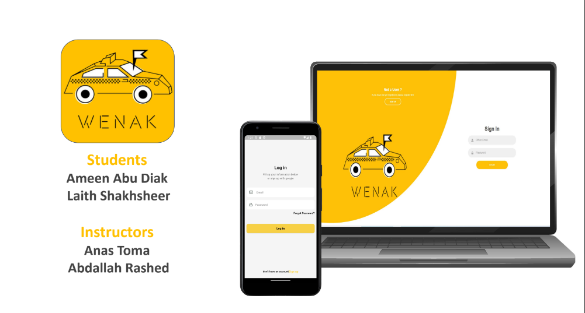

# WENAK - A Novel Transportation System for University Students

WENAK is an innovative transportation system designed to enhance the commuting experience for university students, particularly those traveling from rural areas like Selat al Daher to urban centers such as Nablus. This platform targets approximately 50 students, accounting for about 70% of An-Najah National University's student body.

## Overview

WENAK introduces an advanced web and mobile application tailored for both students and taxi services. The platform enables taxi offices to efficiently manage their fleets, drivers, and vehicles, simplifying the registration process for these offices and allowing them to effectively showcase their services.

## Key Features

- **Taxi Office Management**: Allows taxi offices to manage their fleets, drivers, and vehicles efficiently.
- **Registration and Service Showcase**: Simplifies the registration process for taxi offices to display their services effectively.
- **Messaging Component**: Facilitates communication and coordination between taxi offices and users, enhancing the overall travel experience.
- **Trip Details Posting**: Taxi offices can post specific trip details, empowering students to make informed travel decisions.
- **Booking Notifications**: Users receive notifications about their bookings and can confirm reservations directly through the app.
- **Reservation Management**: The reservation amount is automatically deducted from users' accounts upon confirmation.
- **Cancellation Policy**: Implements a cancellation policy with potential fines to ensure reliability in bookings.
- **Admin Control Panel**: Provides comprehensive data on driver trips for efficient management.
- **Google Maps Integration**: Allows users to easily locate nearby taxi offices.
- **User Interaction**: Features for user interaction with taxi office posts and feedback mechanisms to improve service quality.

## Summary

In summary, WENAK is a user-centric transportation solution that streamlines the taxi booking process and equips taxi offices with effective tools for managing their operations. By significantly enhancing the commuting experience for university students, WENAK addresses the unique transportation needs of its target audience.

## Demo

You can explore the WENAK project demo at the following link: [WENAK Demo](https://drive.google.com/file/d/1Zu01v2nIGtuBcM-BSF9bBRnhQZSlAC-x/view?usp=sharing)
